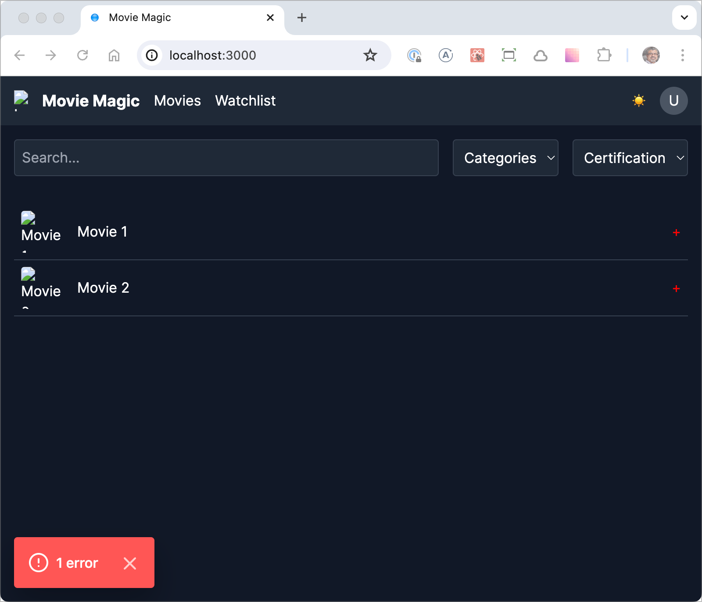
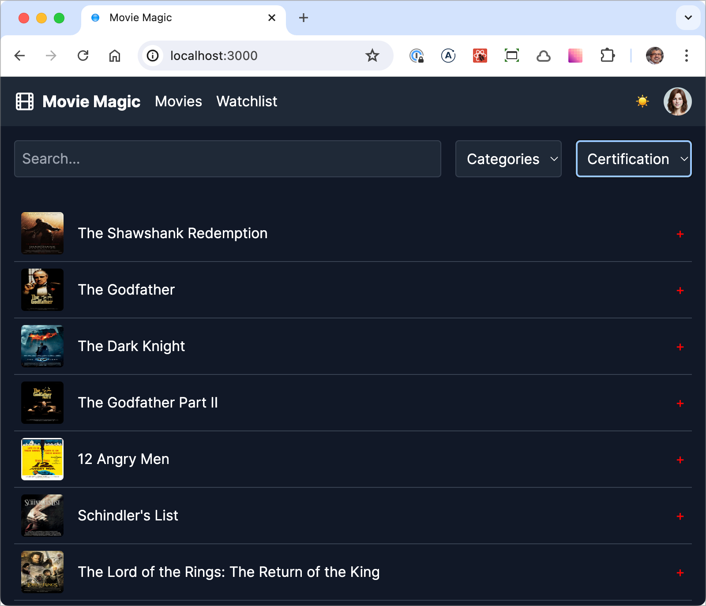
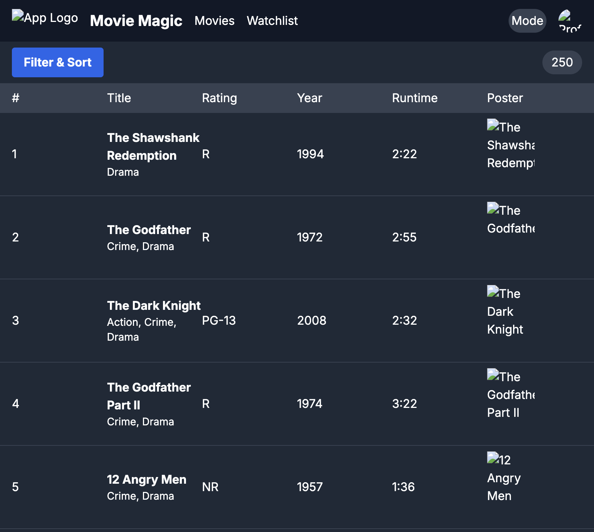
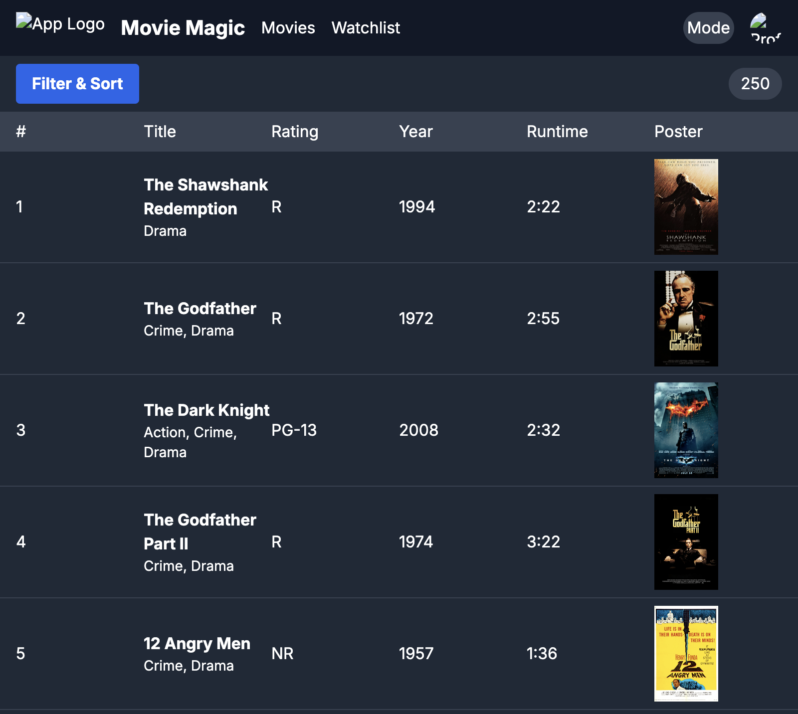

# Movie Magic ChatGPT 4o

A movie streaming app generated by [ChatGPT 4o](https://chatgpt.com) (a general
purpose generative UI tool).

I tried two approaches:

1. Prompts starting with textual requirements
2. Prompts starting with image requirements

For each approach, I implemented that application with the raw implementation
suggested by ChatGPT. Then, I refined the implementation through a series of
manual steps to make the screen look better. Each modification has been
thoroughly documented in the commit history below.

## Tech Stack

1. [TypeScript](https://www.typescriptlang.org/)
2. [Next.js](https://nextjs.org/)
3. [Tailwind CSS](https://tailwindcss.com/)
4. [Radix UI](https://www.radix-ui.com/primitives)

## Build this repository

```shell
npm ci
npm run dev
```

Now point your browser to http://localhost:3000

## Prompting round 1 - starting with textual requirements

## Implementation round 1 - starting with textual requirements

### commit-1

Initial commit with my starter app.


### commit-2

Added code suggested by ChatGPT. While the code was nice and modular, there were
issues with it:

1. ChatGPT does not know that components in Next.js are defaulted to React
   Server Components. I had to add `'use client'` on all components because they
   had some kind of interactivity and/or used hooks.
2. ChatGPT added the `<ThemeProvider>` from `next-themes` directly into
   `app/layout.tsx`. This is not allowed because RootLayout is a server
   component. Had to extract `<ThemeProvider>` into a client component called
   `<AppProvider>`.
3. `@radix-ui/react-avatar` import syntax was not correct.
4. The app was reporting hydration errors on startup, e.g. "Error: Text content
   does not match server-rendered HTML".



### commit-3

Added real movie data. After doing this, the hydration errors went away. They
were probably due to the fake image URLs in the movie data.

As you can see the overall result is pretty good.



## Prompting round 2 - starting with image requirements

The detailed prompts and responses for this round are listed
[here](./chatgpt-4o-start-with-image-as-requirements.md).

## Implementation round 2 - starting with image requirements

Here are the commits for round 2, starting with the raw implementation suggested
by ChatGPT.

> Note: Before these commits, I reset the application back to the starter app.

### commit-4

Added initial code suggested by ChatGPT. Here's the resulting output.



### commit-5

Updated the code as suggested by ChatGPT. While it suggested changing 4 files,
the real difference was only 1 file, MovieList.tsx, where it updated the code to
use URLs for the thumbnail images. Here's the resulting output.



This is definitely better than round 1 (staring with a text prompt) and a
reasonably good starting point.

Here's a subset of requirement that it met very nicely:

1. Header and Navigation height: 56px
2. Filter & Sort height: 56px
3. Movie List Header height: 40px (off by 1 pixel, because it used `h-10`
   instead of using paddings to get to 39px)
4. Movie List Entry height: 112px, which is the exact requirement, however it
   missed the 8px padding. Instead it fixed the height to 112px by using `h-28`.

Here's a list of major deviations from requirements:

1. The Mode Toggle button is implemented using the Radix UI `<Switch>`
   component, but not correctly. Here's the generated code which is not correct:
   `<Switch className="rounded-full bg-gray-700 p-1">Mode</Switch>`.
2. Filter and Sort button does not look like the requirements.
3. The Poster column is out of order.
4. Column widths of the table do not match that of the image.

Still pretty good for automatic generation!
